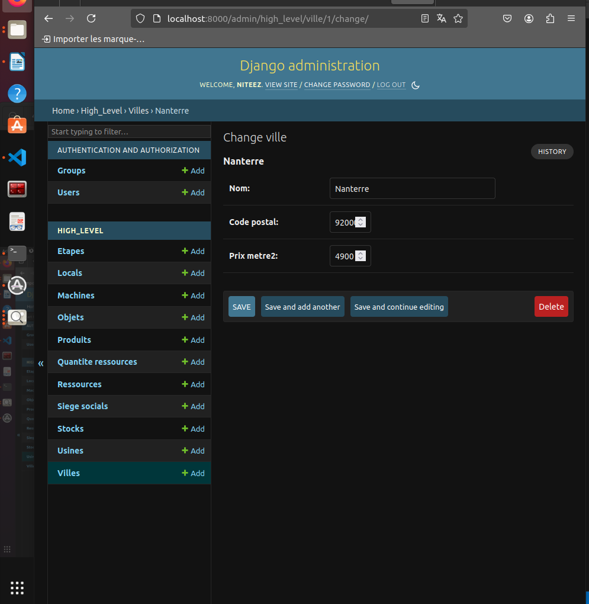
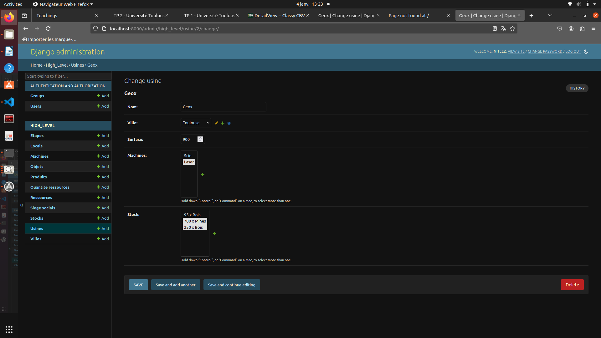

# Pencil Manufacturing Project 

_Author 1_ : Sylvain ETANGSALE <br>
_Author 2_ : Jean-Luc BITOUMBOU-BIBOKA <br>
_Version_ : 04/01/2025

Ce projet Git, intitulé _Pencil Manufacturing Project_, vise à modéliser à l'aide de Django, un système de gestion de crayon comprenant des villes, des locaux, des usines, des ressources ... <br>

L'objectif est de :
- Créer des modèles Django en Python pour représenter ces entités.
- Les afficher sur localhost:8000/ via une **DetailView** avec une méthode json().
- Étendre l'affichage avec une **ApiView** utilisant une méthode json_extended().
- Développer un programme en C++ pour récupérer, lire et afficher les détails de chaque modèle directement dans le terminal de la machine.

Le projet a été réalisé sous Ubuntu 20.04.
## 1. Installation et démarrage 
### 1.0 - Prérequis

Assurez-vous d'avoir les éléments suivants installés sur votre machine : 
- Python 3 : Pour executer le projet
- Pip 
- Git : Pour cloner le dépôt
- Venv : Pour créer un environnement virtuel Python 
```bash
# Mettre a jour la liste des paquets
sudo apt update

# Installer Python 3
sudo apt install python3

# Verifier l'installation de pip
python3 -m pip -V

# Installer Git
sudo apt install git

# Installer venv 
sudo apt install python3-venv
```
- WSL ubuntu si vous utilisez windows

### 1.1 - Cloner le dépôt
- Clonez le dépôt Git du projet en local :
```bash
git clone https://github.com/NiiteeZ/Projet_Crayon.git
```
### 1.2 - Se placer dans le dossier
```bash
cd Projet_crayon/
```
### 1.3 - Configurer l'environnement virtuel
- Créez un environnement virtuel :
```bash
python -m venv .venv
echo .venv >> .gitignore
```
- Activez l'environnement virtuel selon votre machine :
```bash
#Linux
source .venv/bin/activate 

#Windows
.venv\Scripts\activate 
```
### 1.4 - Installer les dépendances nécessaires
- Installez les packages requis pour le projet :
```bash
pip install -U pip
pip install django
```
## 2. Lancement du serveur Django
- Se placez dans le dossier __crayon__ : 
```bash
cd crayon/
```
- Executez les commandes suivantes pour préparer et lancer le serveur :
```bash
python ./manage.py makemigrations
python ./manage.py migrate
```


- Créez un user et mot de passe pour le serveur :
```bash
python ./manage.py createsuperuser
```
- Entrez un username puis appuyez entrer
- Pour l'adresse email on peut simplement appuyer sur entrer
- Entrez un mot de passe (notez le) appuyez entrer
- Confirmez le mot de passe
- Si le mot de passe est trop commun modifiez-le ou appuyez **y**


- Lancez le serveur local en lançant :
```bash
python ./manage.py runserver
```


- Ouvrez le lien suivant avec un navigateur : 
```bash
http://localhost:8000/admin/
```


- Entrez l'Username et le mot de passe crée précédement.
- Vous arriverez à l'accueil : 


## 3. Création d'éléments
A partir d'ici vous pouvez créer différentes villes, ou Locals, Usines etc.

Pour l'exemple nous allons créer : 
- 3 Villes
- 2 Usines avec différentes machines et différents stocks
- 1 Siège Social

On visualisera ensuite avec DetailView et ApiView
### 3.1 Villes
Dans l'accueil _Django administration_ (image précédente), où il est écrit Villes ; sélectionnez **+ Add** pour ajouter une ville : 


- Ville 1 : <br>
-_Nom_: Nanterre <br>
-_Code postale_ : 92000 <br>
-_Prix mètre2_ : 4900 <br>

Enregistrez et créez une deuxième ville en appuyant sur _Save and add another_ 

- Ville 2 : <br>
-_Nom_: Toulouse <br>
-_Code postale_ : 31300 <br>
-_Prix mètre2_ : 3350 <br>

Enregistrez en appuyant sur _Save_

La troisième ville va être créée plus tard.

### 3.2 Usines
- Ajoutez une première usine :
- Usine 1 : <br>
-_Nom_: Quary <br>
-_Ville_ : Nanterre <br>
-_Surface_ : 200 <br>
-_Machines_ : <br>

Pour ajouter une **Machine**, appuyez sur +. Une fenêtre s'ouvre pour insérer ou créer une machine. Pour l'exemple on ajoute :
- Machine 1 : <br>
-_Nom_: Scie <br>
-_Prix_ : 50 <br>
-_N serie_ : 246810 <br>


On enregistre puis on ajoute du **Stock** dans l'usine : 
En cliquant sur +, une première fenêtre **Add Stock** s'ouvre. Pour créer un stock il faut d'abord créer une ressource en appuyant sur +, dans cette même fenêtre. Une fenêtre **Add ressource** s'ouvre. 
Pour l'exemple on crée : <br>
- Ressource 1 : <br>
-_Nom_: Bois <br>
-_Prix_ : 1 <br>


On enregistre puis, on indique le nombre de cette ressource dans la première fenêtre **Add stock**. Pour l'exemple on indique : 
- Stock 1 : <br>
-_Ressource_ : Bois <br>
-_Nombre_ : 95 <br>

 

Finalement on obtient l'usine **Quary** complet :


On effectue la même manipulation pour créer une deuxième usine:

- Usine 2 : <br>
    - _Nom_: Geox <br>
    - _Ville_ : Toulouse <br>
    -  _Surface_ : 900 <br>
    - _Machines_ : <br>
        - Machine 2 : <br>
            - _Nom_: Laser <br>
            - _Prix_ : 150 <br>
            - _N serie_ : 13579 <br>
    - _Stock_ :  <br>
        - Stock 2 :
            - _Ressource_ : <br>
                - Ressource 2 : 
                    - _Nom_: Mines <br>
                    - _Prix_  : 60 <br>
                -   _Nombre_ : 700 <br>
        - Stock 3 :
            - _Ressource_ : <br>
                - Ressource 1 : 
                    - _Nom_: Bois <br>
                    - _Prix_  : 1 <br>
                -   _Nombre_ : 250 <br>
            
Voici l'affichage final de l'usine **Geox** :


### 3.3 Siège Social
Ici on crée un siège social à la Défense : 
- Siege Social : 
    - _Nom_: Tower <br>
    - _Ville_ : 
        - Ville 3 :
            - _Nom_: La Défense
            - _Code postal_: 92400
            - _Prix par metre2_: 8300
    -  _Surface_ : 95 <br>


On remarque qu'on a créé une troisième ville _La Défense_, en créant le siège social.

## 4. Visualisation
On a crée précédement : 
- 3 Villes
- 2 Usines
- 2 Machines
- 2 Ressources
- 3 Stocks
- 1 Siège Social
- (3 Locals car les classes Usines et Siège social héritent de Locals)

Pour les visualiser dans le navigateur, il y a deux types d'affichage : 
- **DetailView** : Qui fournit une vue légère des éléments en renseignant l'**ID** des éléments qui les composent.
- **ApiView** : Qui renseigne le détail complet du modèle en détaillant les éléments qui les composent.

### 4.1 DetailView
Pour consulter les villes créées, dans un navigateur internet coller l'url suivant :
#### 4.1.1 Ville :
```bash
http://localhost:8000/Ville/1
```
L'affichage est le suivant : 


- Le numéro en fin de l'url correspond à l'**ID** de la ville.
Pour connaitre l'ID d'une ville, dans un autre onglet retourner à l'accueil _Django administration_. Allez dans Villes puis cliquez sur une des villes. <br>
Exemple on clique sur **Nanterre** :

L'url en haut de l'écran est : 
```bash
localhost:8000/admin/high_level/ville/1/change/
```
Donc l'**ID** de Nanterre est 1.

Cela permet d'identifier les **ID** de tous les éléments créés. Par exemple le lien de l'usine Geox est : 
```bash
localhost:8000/admin/high_level/usine/2/change/
```

- Son **ID** est donc 2.
#### 4.1.2 Usine
Copier ce lien pour visualiser une usine en remplaçant le terme **ID** à la fin de l'url, par l'**ID** de l'usine concerné :
```bash
http://localhost:8000/Usine/ID
```
Exemple pour ID = 2 :


ici on voit avec la vue légère que la ville de Geox possède l'**ID** = 2, sa machine a l'**ID** = 2 et ses stocks les **ID** 2 et 3. 

#### 4.1.3 Autres
Pour les autres urls, il suffit de prendre la base : 
```bash
http://localhost:8000/
```
et d'ajouter un des éléments : 
- Local/ID
- Machine/ID
- Objet/ID
- SiegeSocial/ID
- Ressource/ID
- QuantiteRessource/ID
- Etape/ID
- Produit/ID
- Stock/ID

Tout en remplaçant le terme **ID** par l'**ID** de l'élément qu'on souhaite visualiser comme expliqué dans les sous parties précédentes. 
### 4.2 ApiView
Pour avoir le détail complet du modèle c'est à dire plus que les **ID** des éléments qui les composent, on utilise ApiView. 
- La base du lien reste le même :
```bash
http://localhost:8000/
```
Puis on ajoute un des éléments qu'on souhaite afficher plus le terme **api** suivi de l'**ID** de l'élément: 
- Ville/api/ID
- Usine/api/ID
- Local/api/ID
- Machine/api/ID
- Objet/api/ID
- SiegeSocial/api/ID
- Ressource/api/ID
- QuantiteRessource/api/ID
- Etape/api/ID
- Produit/api/ID
- Stock/api/ID

Par exemple pour visualiser le **siège social** créé, on cherche son **ID** comme expliqué dans la [partie précédente](#41-detailview), puis on le recherche avec son lien api : 
```bash
http://localhost:8000/SiegeSocial/api/3
```

On remarque qu'on a accès au détail de la ville du siège. En effet au lieu d'avoir uniquement "ville : **3**" on a : 
- ville : 
    - _Nom_ : La Défense
    - _Code postale_ : 92400
    - _Prix par m2_ : 8300

## 5. Récupération et affichage des données créées (C++)
Après avoir [Lancer le serveur Django](#2-lancement-du-serveur-django) et [créé des éléments](#3-création-déléments), dans un autre terminal lancez les commandes qui vont suivre dans les deux prochaines sous parties.
## 5.1 Installer les dépendances nécessaires
```bash
# Se placer dans le dossier low_level
cd Projet_crayon/crayon/low_level 

# Installer cmake
pip install cmake
```
## 5.2 Compiler et éxécuter le programme C++
```bash
# Generer les fichiers de construction
cmake -B build -S .

# Compiler le projet
cmake --build build

# Executer le programme compiler
./build/low_level

# Ajouter le dossier de build au .gitignore
echo build >> .gitignore
```
- On obtient, après avoir compilé : 


Cela affiche toutes les entités créées avec Django précédement de manière détaillé.


## 6. Test unitaire
### 6.1 Mise en situation
Avant d'avoir effectué les parties de manipulations et de créations d'éléments nous avons implémenté un scénario de test qui valide le calcul des coût dans un cas connu. Nous avons pris : 
- Une **Usine** de 50m²
- Dans la Ville Labège à 2 000 €/m²
- Avec une Machine à 1 000 €, et une autre à 2 000 €
- Un stock : 
    - 1000 kg de bois à 10 €/kg
    - 50 m de mine à 15 €/m

- Dans la classe **Usine**, une méthode **cost()** qui calcul le coût est directement implémenté. 

- Le test unitaire est implémenté dans le fichier test.py

- On utilise : 
```bash
self.assertEqual(Usine.objects.first().costs(), 110750)
```
Pour vérifier que le coût est de 110750€. 
### 6.2 Lancer le test
- Se placer dans le dossier **Projet_Crayon/crayon**
- Dans se dossier il y a un fichier **manage.py**
- Exécutez le programme de test en lançant : 
```bash
python ./manage.py test
```

- Après exécution on voit que le coût n'est pas de 110750 € mais de **113750 €** ce qui est finalement le prix exact. 